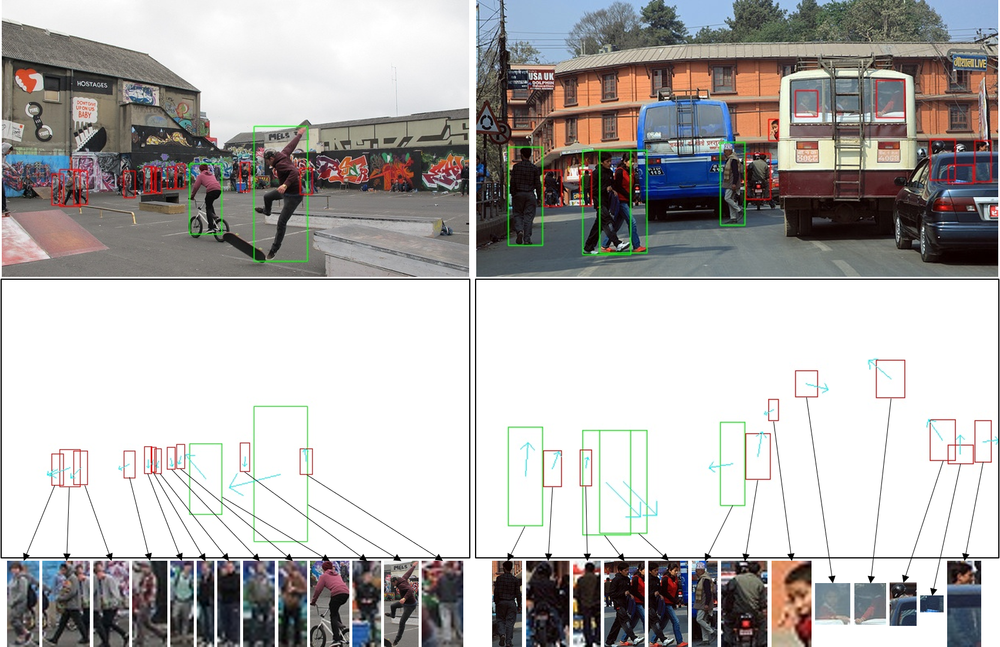
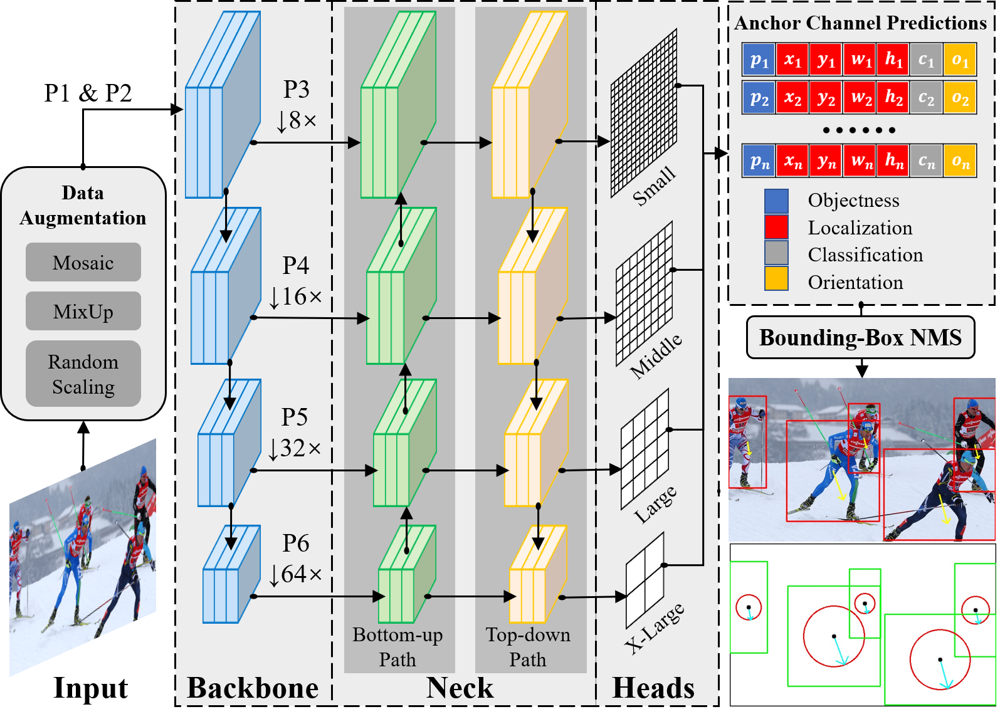

# JointBDOE
Code for my work "Joint Multi-Person Body Detection and Orientation Estimation via One Unified Embedding"

**Abstract:** Human body orientation estimation (HBOE) is widely applied into various applications, including robotics, surveillance, pedestrian analysis and autonomous driving. Although many approaches have been addressing the HBOE problem from specific under-controlled scenes to challenging in-the-wild environments, they assume human instances are already detected and take a well cropped sub-image as the input. This setting is less efficient and prone to errors in real application, such as crowds of people. In the paper, we propose a single-stage end-to-end trainable framework for tackling the HBOE problem with multi-persons. By integrating the prediction of bounding boxes and direction angles in one embedding, our method can jointly estimate the location and orientation of all bodies in one image directly. Our key idea is to integrate the HBOE task into the multi-scale anchor channel predictions of persons for concurrently benefiting from engaged intermediate features. Therefore, our approach can naturally adapt to difficult instances involving low resolution and occlusion as in object detection. We validated the efficiency and effectiveness of our method in the recently presented benchmark MEBOW with extensive experiments. Besides, we completed ambiguous instances ignored by the MEBOW dataset, and provided corresponding weak body-orientation labels to keep the integrity and consistency of it for supporting studies toward multi-persons.

<table>
<tr>
<th>Examples of COCO-MEBOW with full labels</th>
<th>The overall architecture of JointBDOE</th>
</tr>
<tr>
<td></td>
<td></td> 
</tr>
</table>

## Installation

**Environment:** Anaconda, Python3.8, PyTorch1.10.0(CUDA11.2), wandb

```bash
$ git clone https://github.com/hnuzhy/JointBDOE.git
$ pip install -r requirements.txt -i https://pypi.tuna.tsinghua.edu.cn/simple

# Codes are only evaluated on GTX3090+CUDA11.2+PyTorch1.10.0. You can follow the same config if needed
# [method 1][directly install from the official website][may slow]
$ pip3 install torch==1.10.0+cu111 torchvision==0.11.1+cu111 torchaudio==0.10.0+cu111 \
  -f https://download.pytorch.org/whl/cu111/torch_stable.html
  
# [method 2]download from the official website and install offline][faster]
$ wget https://download.pytorch.org/whl/cu111/torch-1.10.0%2Bcu111-cp38-cp38-linux_x86_64.whl
$ wget https://download.pytorch.org/whl/cu111/torchvision-0.11.1%2Bcu111-cp38-cp38-linux_x86_64.whl
$ wget https://download.pytorch.org/whl/cu111/torchaudio-0.10.0%2Bcu111-cp38-cp38-linux_x86_64.whl
$ pip3 install torch*.whl
```

## Dataset Preparing


## Training and Testing


## References
